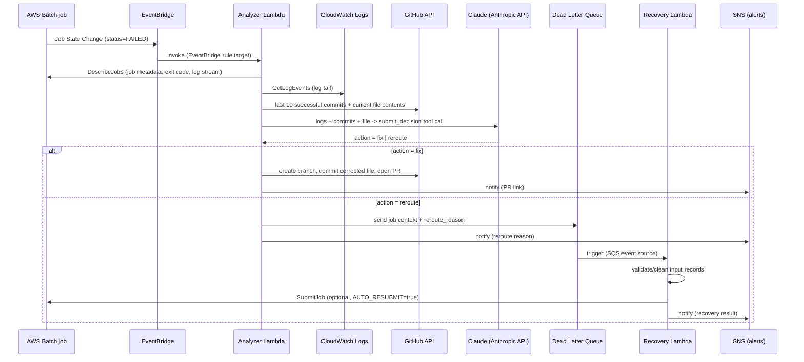

# Architecture

## Flow

## Components

| Component | What it is | Where |
|---|---|---|
| `AgenticBatchDebugCore` stack | EventBridge rule, both Lambdas, DLQ, quarantine bucket, secrets, SNS topic | `cdk/stacks/core_stack.py` |
| `AgenticBatchDebugDemo` stack | Fargate Batch compute env/queue/job def, ECR repo, sample data bucket | `cdk/stacks/demo_stack.py` |
| Analyzer Lambda | Diagnoses a failure and picks an action | `agent/analyzer_handler.py` |
| Recovery Lambda | Runs domain-specific cleanup on rerouted jobs | `agent/recovery_handler.py`, `agent/recovery/recovery_script.py` |
| Client wrappers | Thin, mockable wrappers around Batch/Logs/GitHub/Anthropic/SQS/SNS/Secrets | `agent/clients/` |

## Why these choices

**EventBridge, not Batch job retries or a polling Lambda.** AWS Batch already emits a `Batch Job State Change` event to the default event bus on every state transition. Matching `detail.status = FAILED` is the cheapest, lowest-latency way to react - no polling, no extra infrastructure to keep in sync with job state.

**Two separate Lambdas, not one.** The analyzer (EventBridge-triggered, synchronous-ish, calls out to GitHub + Claude) and the recovery worker (SQS-triggered, potentially higher volume, different failure/retry semantics) have different concurrency, timeout, and IAM needs. Splitting them keeps each one's blast radius and permission set small.

**Full corrected file contents, not a diff, for the `fix` action.** Asking an LLM to emit a syntactically valid unified diff that applies cleanly is a common source of silent failures (context-line mismatches, off-by-one hunks). Asking for the complete new file content is more tokens but far more reliable, and it's what the GitHub Contents API needs anyway to create a commit. The tradeoff: this only works well for files small enough to fit comfortably in the prompt/response - see Limitations below.

**A guardrail Lambda-side, not just a good prompt.** The system prompt tells Claude to only choose `fix` when confident and when it has full file context - but prompts are not enforcement. `analyzer_handler._diagnose` re-checks, in code, that a `fix` decision actually has a resolvable repo, file path, and file content before calling the GitHub API; otherwise it downgrades to `reroute`. Never let a model's own self-reported confidence be the only thing standing between it and writing to your repository.

**Reroute goes to an SQS queue, not straight to a Slack ping.** Treating "not a fixable code bug" as a queue of work (rather than a one-off notification) lets the recovery path be async, retryable, and batchable, and gives you a natural audit trail (queue depth, DLQ-of-the-DLQ if recovery itself fails, CloudWatch metrics).

**Job tags carry the GitHub context, not a hardcoded mapping.** A single deployment of this stack can watch many different Batch job definitions, each backed by a different repo/file, by tagging jobs with `agentic-debug:repo` / `agentic-debug:entrypoint` / `agentic-debug:ref` at submit time. `DEFAULT_GITHUB_REPO` / `DEFAULT_ENTRYPOINT` / `DEFAULT_REF` environment variables are a fallback for single-repo setups where tagging every job is overkill.

**Local pip bundling for Lambda, with a Docker fallback.** `cdk/stacks/lambda_bundling.py` tries a local `pip install --platform manylinux2014_x86_64` first (fast, no Docker daemon required - useful in CI and sandboxed dev environments) and only falls back to Docker-based bundling if that fails. This repo's dependencies (`boto3`, `requests`, `anthropic`) are all pure-Python-plus-prebuilt-wheels, so local bundling works in practice.

## Limitations (this is a reference implementation, not a production system)

- **No sandboxed validation of proposed fixes.** The agent opens a PR; nothing runs the corrected file's tests before that happens. Branch protection + required reviews on the target repo is your real safety net, not the agent's confidence score.
- **Single-file fixes only.** The `fix` action can only rewrite one file. A root cause that spans multiple files (a shared library plus a caller) will get rerouted instead, by design (the guardrail requires a single resolvable `fix_file_path`).
- **"Last N successful commits" is CI-status-based, not semantically filtered.** A commit counts as successful if its combined GitHub status/checks state is `success`, or if the repo has no CI configured at all. It does not know whether a "successful" commit is actually related to the failure.
- **DLQ recovery logic is domain-specific by construction.** `agent/recovery/recovery_script.py` implements one illustrative repair strategy (drop/clean malformed order records) for the demo's data shape. Adapting this to your own pipeline means rewriting `_clean_orders` (or the whole module) for your schema.
- **AUTO_RESUBMIT defaults to `false`.** Automatically resubmitting a cleaned job is the highest-blast-radius action in this whole system (it can create an infinite retry loop if the "cleaning" logic doesn't actually fix the underlying problem). Turn it on deliberately, and only after you trust the recovery logic.
